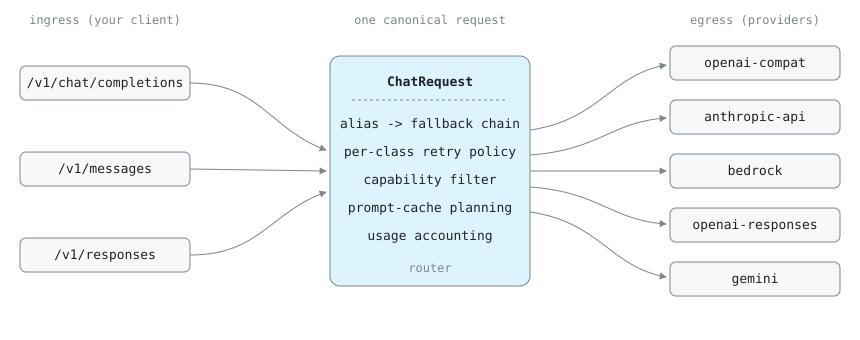

# routectl

**One local endpoint for every LLM provider you use.**

routectl is a single Rust binary that runs on `127.0.0.1` and speaks
the OpenAI and Anthropic APIs. Point Claude Code, codex, opencode, or
any OpenAI/Anthropic SDK at it -- without changing the client -- and
every request gets automatic fallback across providers, cost tracking,
and one config file for all your keys.

[](LICENSE)
[](https://www.rust-lang.org)
[](docs/DEVELOPMENT.md)

```
your client speaks              routectl routes                to any provider
OpenAI or Anthropic     -->     fallbacks, retries,     -->    OpenAI, Anthropic, Bedrock,
wire format                     cost tracking                  Gemini, DeepSeek, Groq, ...
```

## Why routectl

- **Real fallback, not just retries.** Aliases map to fallback chains
  across providers. Failures are classified (`rate-limited`, `auth`,
  `bad-request`, ...) and each class gets its own retry and fallback
  policy, plus per-provider rate limits and a circuit breaker.
- **Translation that preserves the hard parts.** Reasoning blocks,
  prompt-cache markers, tool calls, and images all survive
  cross-provider hops, so upstream prompt caches stay warm.
- **Learns what your providers can actually do.** A capability
  registry learns from live rejections, persists across restarts, and
  routes requests away from targets that cannot honor them.
- **Local-first and refs-only.** Binds loopback by default; refuses
  public binds without an explicit flag. Config stores secret
  *references* (`env://`, `file://`, `oauth://`), never plaintext.
  See [SECURITY.md](SECURITY.md).
- **Observability built in.** A per-request SQLite usage ledger, a
  read-only dashboard at `GET /`, and `routectl usage` cost summaries.

## Install

### Pre-built binaries

Binaries are published per release for Linux (x86_64, aarch64), macOS
(Apple Silicon), and Windows (x86_64). Grab the latest from the
[releases page](https://github.com/meepolabs/routectl/releases/latest),
or from the shell:

```bash
VERSION=$(curl -s https://api.github.com/repos/meepolabs/routectl/releases/latest | grep tag_name | cut -d'"' -f4 | sed 's/^v//')

# pick your platform: linux-x86_64, linux-aarch64, macos-aarch64, windows-x86_64.exe
curl -fL "https://github.com/meepolabs/routectl/releases/latest/download/routectl-${VERSION}-linux-x86_64" -o /usr/local/bin/routectl
chmod +x /usr/local/bin/routectl
routectl --help
```

<details>
<summary>macOS Gatekeeper and release verification (optional)</summary>

`curl` does not set the `com.apple.quarantine` xattr, so macOS
Gatekeeper does not prompt. If you downloaded via a browser instead,
run once: `xattr -d com.apple.quarantine /usr/local/bin/routectl`

Releases ship a cosign-signed `SHA256SUMS`; verify with:

```bash
cosign verify-blob \
  --certificate-identity-regexp '^https://github\.com/meepolabs/routectl/\.github/workflows/release\.yml@refs/tags/v[0-9]' \
  --certificate-github-workflow-repository meepolabs/routectl \
  --certificate-oidc-issuer https://token.actions.githubusercontent.com \
  --bundle SHA256SUMS.cosign.bundle SHA256SUMS

sha256sum -c SHA256SUMS
```

</details>

### From source

Requires Rust 1.95.

```bash
git clone https://github.com/meepolabs/routectl
cd routectl
cargo build --release
./target/release/routectl --help
```

## Quick start

The guided path -- `routectl init` walks provider setup, secret
capture, and routing, then offers a verification probe:

```bash
routectl init
routectl serve
# routectl listening on http://127.0.0.1:8787
```

Or by hand:

```bash
mkdir -p ~/.config/routectl
routectl config example > ~/.config/routectl/config.toml
# edit: add provider keys + aliases
routectl config check
routectl serve
```

Then send requests in whichever dialect your client speaks:

```bash
# OpenAI Chat Completions
curl -N -X POST http://127.0.0.1:8787/v1/chat/completions \
  -H 'Content-Type: application/json' \
  -d '{"model": "fast", "messages": [{"role": "user", "content": "say hi"}], "stream": true}'

# Anthropic Messages
curl -N -X POST http://127.0.0.1:8787/v1/messages \
  -H 'Content-Type: application/json' \
  -d '{"model": "fast", "max_tokens": 64, "messages": [{"role": "user", "content": "say hi"}], "stream": true}'

# One-shot via CLI
routectl test fast --prompt "say hi in five words"
```

`routectl doctor` diagnoses a setup end to end; the dashboard at
`http://127.0.0.1:8787/` shows live usage, target health, and the
capability matrix.

## How it works

routectl is a hub-and-spoke translation pipe: three ingress dialects
(OpenAI Chat Completions, Anthropic Messages, OpenAI Responses) parse
into one canonical request shape, the router resolves the alias to a
fallback chain and applies policy, and one of five egress provider
classes translates back out. N+M translators instead of NxM -- a new
ingress dialect or egress provider is one file that knows nothing
about the other side.



See [`docs/ARCHITECTURE.md`](docs/ARCHITECTURE.md) for the crate map.

## Configuration

Minimal example:

```toml
[server]
host = "127.0.0.1"
port = 8787

[providers.deepseek]
kind = "openai-compat"
base_url = "https://api.deepseek.com/v1"
api_key_ref = "env://DEEPSEEK_API_KEY"
reasoning_dialect = "deepseek"

[providers.anthropic]
kind = "anthropic-api"
api_key_ref = "env://ANTHROPIC_API_KEY"

[models.fast]
provider = "deepseek"
upstream = "deepseek-chat"

[models.heavy]
provider = "anthropic"
upstream = "claude-opus-4-20250514"
supports_adaptive_thinking = true

[aliases]
fast  = "fast"
heavy = ["heavy", "fast"]        # fallback chain
"claude-opus-*" = "heavy"        # suffix-glob routing
default = "fast"
```

Credentials resolve through URI schemes -- `env://VAR`,
`file:///abs/path` (owner-only), or `oauth://<provider>` (managed by
`routectl login`); inline literals are rejected outright. The full
config surface -- retry policy, capability overrides, cache knobs, the
model catalog, hot-reload, managed OAuth -- lives in
[`docs/CONFIGURATION.md`](docs/CONFIGURATION.md), with a committed
JSON Schema (`routectl.schema.json`) for editor completion.

## Provider classes

| Kind | Speaks | Auth |
|---|---|---|
| `openai-compat` | Any OpenAI-shape host (OpenAI, DeepSeek, OpenRouter, Groq, NIM, vLLM, llama.cpp, ...), six reasoning dialects | API key |
| `anthropic-api` | Native Anthropic Messages, incl. Claude Code gateway support | API key, OAuth, or forwarded client credential |
| `bedrock` | AWS Bedrock InvokeModel + Converse, plus bearer-key lanes | SigV4 credential chain or bearer key |
| `openai-responses` | OpenAI Responses API / ChatGPT Codex | ChatGPT OAuth, API key, or Bedrock bearer |
| `gemini` | Native Google Gemini `generateContent` | API key or Cloud Code OAuth |

Per-provider knobs and per-model tips live in
[`docs/CONFIGURATION.md`](docs/CONFIGURATION.md) and
[`docs/PROVIDER-QUIRKS.md`](docs/PROVIDER-QUIRKS.md).

## Claude Code as a gateway client

routectl implements Anthropic's [published gateway
pattern](https://code.claude.com/docs/en/llm-gateway): attribution
headers, a `count_tokens` proxy, and forward-compat for unknown SSE
block types. An optional front-proxy lets Claude Code route inference
through routectl while Remote Control (Claude Code's phone/web
takeover feature) keeps working against `api.anthropic.com`. See
[`docs/REMOTE-CONTROL.md`](docs/REMOTE-CONTROL.md) and read
[Responsible use](#responsible-use) first.

## Documentation

| Doc | Read it for |
|---|---|
| [`docs/CONFIGURATION.md`](docs/CONFIGURATION.md) | The full TOML reference: providers, models, aliases, retry, cache, OAuth login, CLI config commands |
| [`docs/PROVIDER-QUIRKS.md`](docs/PROVIDER-QUIRKS.md) | Per-model config recipes + a troubleshooting matrix |
| [`docs/LOGGING.md`](docs/LOGGING.md) | Log levels, triage recipes, redaction guarantees |
| [`docs/REMOTE-CONTROL.md`](docs/REMOTE-CONTROL.md) | The optional Claude Code front-proxy |
| [`docs/ARCHITECTURE.md`](docs/ARCHITECTURE.md) | Crate map and the hub-and-spoke design |
| [`docs/DEVELOPMENT.md`](docs/DEVELOPMENT.md) | Contributor workflow: gates, runbooks, add-a-model recipes |
| [`docs/TESTED_MODELS.md`](docs/TESTED_MODELS.md) | The verified live model matrix |
| [`ROADMAP.md`](ROADMAP.md) / [`CHANGELOG.md`](CHANGELOG.md) | Release trajectory + change history |

The [`docs/README.md`](docs/README.md) index maps every doc to the
task it serves.

## Testing

```bash
# Unit + integration tests, no network.
cargo test --workspace --release

# Live integration matrix (opt-in; skips per-provider when its env key is absent).
cargo test -p routectl-cli --features live-integration --release \
  --test live_matrix -- --nocapture --test-threads=1
```

## Out of scope

Multi-user auth, TLS termination, multi-tenancy, a config-editing web
UI, a caching layer, and in-proxy cost-based routing decisions are all
deliberate non-goals -- see [ROADMAP.md](ROADMAP.md) for the full list
and rationale. If you need those, reach for
[LiteLLM](https://github.com/BerriAI/litellm) or a dedicated gateway.

## Responsible use

routectl is a translation pipe. It forwards whatever credentials you
supply and does not vouch for whether a particular credential is
permitted to be used a particular way. **routectl does not support or
condone gateway usage beyond what the upstream provider permits.**
Read the upstream provider's terms before pointing routectl at
production traffic.

- Anthropic publishes a gateway pattern at
  <https://code.claude.com/docs/en/llm-gateway> for first-party
  deployments; routectl's claude-code support implements that
  pattern.
- Per the Anthropic Agent SDK overview, claude.ai OAuth tokens may
  NOT be embedded in third-party products. The `oauth://anthropic`
  ref is for personal-use proxying with the operator's own
  subscription token; do not deploy a routectl instance that resolves
  your ref under other users' requests.
- Read Anthropic's [Acceptable Use
  Policy](https://www.anthropic.com/legal/aup) and [Usage
  Policy](https://www.anthropic.com/legal/usage-policy) before
  production traffic.
- For Codex / ChatGPT credentials, read OpenAI's [Terms of
  Use](https://openai.com/policies/terms-of-use) and [Service
  Terms](https://openai.com/policies/service-terms).
- For Bedrock, the AWS service terms and the underlying
  foundation-model vendor's terms both apply.

## Contributing

Issues and PRs welcome. Start with
[`docs/DEVELOPMENT.md`](docs/DEVELOPMENT.md) (workflow, verification
gate, debug runbooks) and [`docs/ARCHITECTURE.md`](docs/ARCHITECTURE.md)
(where things live). [`SECURITY.md`](SECURITY.md) covers the security
posture and vulnerability reporting.

Conventions: ASCII-only in source and commits; functions under 50
lines, files under 800; one file per dialect, one row per quirk in
the model-profile table.

## License

MIT. See [`LICENSE`](LICENSE).
